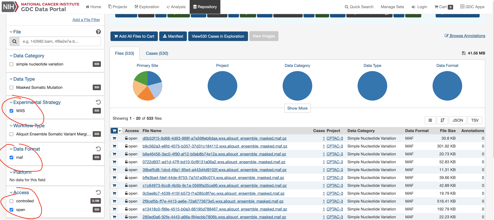

# More-cancer-mutation-analysis
Analysis of mutations in new cohorts after TCGA, such as ICGC, CPTAC and GENIE, using the tools developed in the NeST paper, and potentially in the HiDeF paper.

# for details, and the project progress, please see the Wiki page.
https://github.com/fanzheng10/More-cancer-mutation-analysis/wiki

# MutSigCV 1.4

With the modified output including the "probability of mutating gene X in patient Y"

Usage (here breaking lines to show some clarity, don't break when actually run them):   
```
/cellar/local/matlab_linux64_R2016b/bin/matlab
 -nodisplay -nojvm -r 
 "MutSigCV('blca.maf',
           'exome_full192_coverage.txt',
           'gene.covariates.txt',
           'output', 
           'mutation_type_dictionary_file.txt',
           'chr_files_hg38');
quit"
```
The input is a MAF file (e.g. `blca.maf`), which calls MutSigCV from MATLAB. `output` above specify an output directory. Other files are really big so there are not here but on the lab server. In the output directory there will be a file ending with "p1gp", which is the per-patient probability we are looking for.

### Original website
https://software.broadinstitute.org/cancer/cga/mutsig


### the links of other files here

`/cellar/users/f6zheng/work_2020/nest_confirmatory/n4wilson/mutsigcv_files` (contains coverage, covariates and dictionary)
`/cellar/users/f6zheng/Data/Public_data/chr_files_hg38`

However, needs to be careful to find out whether the new studies uses hg19, it is possible that they use hg38

confirmed that the CPTAC cohort use GRch38 (hg38);

Download from 
Updates: need to convert the FASTA file downloaded from `https://hgdownload.soe.ucsc.edu/goldenPath/hg38/chromosomes/` to txt (remove header and newlines) before they can be used by MutSigCV.


# Obtaining the MAF files (CPTAC)

1. Go to [GDC commons](https://portal.gdc.cancer.gov/exploration)
2. Select CPTAC studies; select WXS (whole-exome sequencing); download MAF files (via `gdc-client`)

<p align="center">
  
</p>

3. Concatenate MAF files. In theory, the MAF file should be able to be used as the input of the matlab code. 
